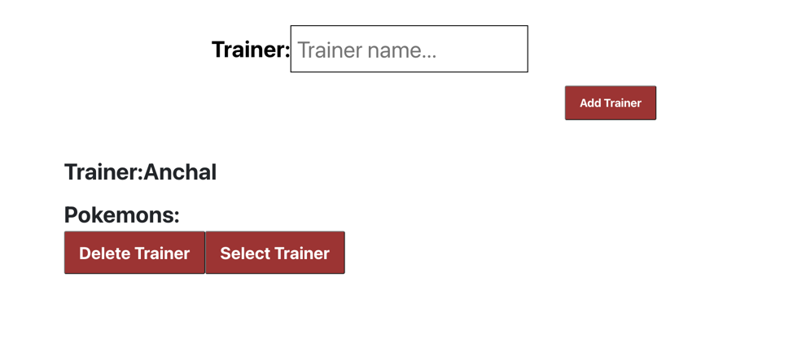

# Pokemon

This is a Pokemon app using GraphQL with Apollo server and a client done with Apollo Client and React. You can be a trainer, catch pokemon and release them. You can get info about each pokemon.

## Demo

### Home

### Pokemon Tab

This shows a paginated list of all the pokemons

You can click on any pokemon to view the details. You can also catch/release the pokemon from here.

### Trainer Tab

You can add or select or delete a trainer from this page. The selected trainer can catch the pokemons.

The added trainer appears as below:

Now on navigating to the pokemons page, a user can catch the pokemon and the button changes to release.

On going to the trainers page, we can see that pokemon added to the selected trainer's team

### Search Tab

Any pokemon can be searched from this search tab and user can view this pokemon from here.

## To Run this

`npm install` on the root dir for the server
`npm start` to start the server
`cd client`
`npm install` to install the client
`npm start` to start the client
